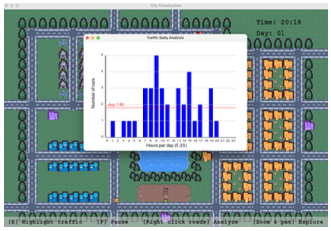
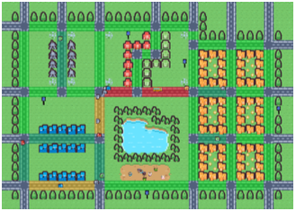

# Traffic Simulator

Simulating and analyzing city traffic can be useful for example when one wants to predict traffic jams or estimate effect of new roads. Numerous different factors make traffic highly nonlinear, almost chaotic system. Goal of this project is to create configurable traffic simulator and analysis tools for it.

The goal is to make analysis software capable of processing potentially large cities, so implementing an GUI is optional as it would cause unnecessary bottlenecking. If you wish to implement a GUI, try to implement your software in such a way that simulation and visualization remain decoupled. (Simulation can be run without a GUI)

# Group 3
- Duc Tung Nguyen
- Vu Minh Nguyen
- Nam Khanh Thieu
- Bach Tue Dinh

# Analysis Tool and Map Visualization

<!-- Two images side by side -->

  
  

# Project Implementation 
You must use git repository for the work on the project, making frequent enough commits so 
that the project group (and course staff) can follow the progress.

The completed project work will be demonstrated to the group's advisor at a demo session. 
The final demonstrations are arranged on week 50. After the final demonstrations project group 
evaluates another project, and self-evaluates own project. In addition, project members will 
give a confidential individual assessment of each group member

The course staff should be able to easily compile the project work using makefile and related 
instructions provided in the git repository. The final output should be in the **master branch** of the git repository.

# Source code documentation
Since we are using Doxygen for code documentation, you can check out the documentation. The command to run the HTML file varies by operating system, but for example, on macOS, you can execute the following commands:

- cd doxygen-docs  
- cd html  
- open index.html  

For another operating system to run this HTML file, you can install **Live Server** extension, get to the doxygen-docs/html, right click on **index.html** and browse  **http://localhost:5500/doxygen-docs/html/annotated.html**, you can see the code documentation

# Running instruction
> Before compiling and running the software, remember to install Cmake, FSML, GoogleTest, instructions for doing those can be found online

To build and use the software, start by navigating to the root directory of the project. From there, run the following commands to generate the necessary build files in the build directory:

- mkdir build  
- cd build  
- cmake ..  

Next, run the following command to compile the program:

- make

Once the build process is complete, launch the application by running:

- ./TrafficSimulator

Alternatively, we created a Bash script file to run this faster. Run the following commands to run the software:

- ./run-app.sh

# Testing instruction
> Before compiling and running the unit tests, remember to install Cmake, FSML, GoogleTest, instructions for doing those can be found online

To run the unit tests, start by navigating to the root directory of the project. From there, run the following commands to generate the necessary build files in the build directory:

- mkdir build  
- cd build  
- cmake ..  

Next, run the following command to compile the program:

- make

Once the build process is complete, launch the application by running:

- ./TrafficSimulatorTests

Alternatively, we created a Bash script file to run this faster. Run the following commands to run the unit tests:

- ./run-test.sh
